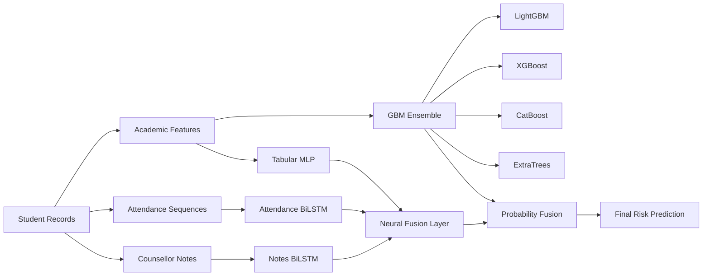
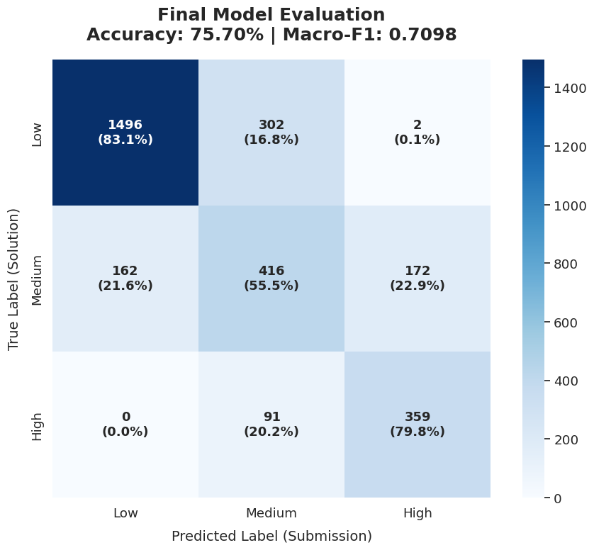

# Retina AI: Multimodal Student Dropout Risk Prediction

Predicting student dropout risk using academic trajectories, attendance behavior, and counsellor interventions through a multimodal machine learning framework.

## Competition

**Retina AI: Predict Student Dropout Risk with Deep Learning**

Competition Link:
https://www.kaggle.com/competitions/retina-ai-predict-student-dropout-risk-with-deep-learning

Technical Writeup:
https://www.kaggle.com/competitions/retina-ai-predict-student-dropout-risk-with-deep-learning/writeups/retina-ai-kkw

---

# Results

| Metric              | Score      |
| ------------------- | ---------- |
| OOF Macro-F1        | **0.7227** |
| Evaluation Macro-F1 | **0.7098** |
| Accuracy            | **75.70%** |

### Key Achievement

**Zero High-Risk students were misclassified as Low-Risk.**

In a real educational setting, this is the most critical prediction error because it prevents timely intervention. Eliminating this failure mode was a primary objective of the final solution.

---

# Problem Statement

Student dropout is rarely caused by a single event.

Warning signs typically appear weeks or months before a student leaves:

* Declining attendance
* Falling academic performance
* Growing backlogs
* Financial stress
* Counsellor observations indicating disengagement

The challenge is that these signals exist across different systems and are rarely analyzed together.

The goal of this project was to combine these heterogeneous signals into a unified prediction framework capable of identifying vulnerable students early enough for meaningful intervention.

---

# My Approach

Rather than treating dropout prediction as a conventional tabular classification problem, I focused on modelling **student trajectory**.

The central hypothesis was:

> Direction of change is more informative than current state.

Examples:

* A CGPA of 6.5 can indicate improvement for one student and decline for another.
* Attendance of 70% may indicate recovery or disengagement depending on previous weeks.
* A counsellor note becomes significantly more valuable when viewed alongside attendance and academic trends.

To capture this behavior, the solution combines:

* Academic trend modelling
* Attendance sequence modelling
* Counsellor note intelligence
* Target encoding
* Ensemble learning
* Multimodal fusion

---

# Solution Architecture

The final solution consists of two independent prediction streams combined through probability-level fusion.



---

# Dataset Components

The competition data combines multiple educational modalities.

| Component          | Description                          |
| ------------------ | ------------------------------------ |
| Student Records    | Demographic and academic information |
| Attendance Logs    | Weekly attendance history            |
| Counsellor Notes   | Student intervention records         |
| Competition Labels | Dropout risk category                |

Target Classes:

* Low Risk (0)
* Medium Risk (1)
* High Risk (2)

---

# Feature Engineering

Feature engineering contributed more to performance than model complexity.

## Academic Features

Generated features included:

```text
cgpa_mean
cgpa_slope
cgpa_drop_max
cgpa_d21
cgpa_d32
cgpa_d43
```

These capture both academic performance and direction of change.

---

## Backlog Features

```text
backlog_total
backlog_trend
```

Backlog accumulation emerged as one of the strongest indicators of dropout risk.

---

## Attendance Intelligence

Attendance data was transformed into two separate representations.

### Aggregate Features

```text
attendance_mean
attendance_std
attendance_min
attendance_max
att_slope_sem3
```

### Sequence Representation

Attendance histories were reshaped into temporal sequences for BiLSTM processing.

```text
Shape: (24, 3)
```

This allowed the model to learn behavioral patterns rather than relying solely on summary statistics.

---

## Financial Risk Features

Composite indicators were created from:

* Family income
* Scholarship status
* Employment information

Example:

```text
financial_stress_index
```

---

# Counsellor Note Intelligence

The counsellor notes contained valuable contextual information often unavailable in structured datasets.

Instead of relying entirely on automated NLP pipelines, domain knowledge was incorporated directly.

## Note Severity Score

A manually engineered severity scale was created:

| Severity | Example                    |
| -------- | -------------------------- |
| 0        | Performing well            |
| 1        | Minor attendance concerns  |
| 2        | Academic difficulties      |
| 3        | Multiple backlogs          |
| 4        | Financial dropout concerns |

Generated feature:

```text
note_severity_score
```

This became one of the strongest predictive signals.

---

# Target Encoding

Several high-cardinality variables were encoded using Out-of-Fold multiclass target encoding.

Features included:

```text
note_te_p0
note_te_p1
note_te_p2

sit_te_p0
sit_te_p1
sit_te_p2
```

All encodings were generated inside cross-validation folds to eliminate leakage.

---

# Modeling Strategy

## Stream 1: GBM Ensemble

The first prediction stream consists of:

* LightGBM
* XGBoost
* CatBoost
* ExtraTrees

Class probabilities are averaged to produce:

```text
P_gbm
```

---

## Stream 2: Multimodal Neural Network

The neural architecture contains three parallel branches.

### Tabular Branch

```text
Input
→ Dense(128)
→ Dense(64)
```

### Attendance Branch

```text
BiLSTM
Input Shape: (24, 3)
```

### Notes Branch

```text
Embedding
→ BiLSTM
```

All branches are fused through a shared classification head.

Output:

```text
P_nn
```

---

## Final Fusion

Final predictions are generated through probability blending.

```text
P_final = 0.6 × P_gbm + 0.4 × P_nn
```

A class-weighted inference strategy is then applied to improve Macro-F1.

---

# Handling Class Imbalance

Three separate interventions were used:

1. Class-weighted neural network loss
2. Balanced tree-based learners
3. Class-weighted inference optimization

This significantly improved Medium-Risk and High-Risk class performance.

---

# Experiment Progression

Every component was introduced only after demonstrating measurable improvement.

| Stage                      | OOF Macro-F1 |
| -------------------------- | ------------ |
| LightGBM Baseline          | 0.6741       |
| GBM Ensemble               | 0.6989       |
| + Neural Network Blend     | 0.7151       |
| + Class-Weighted Inference | 0.7227       |

---

# Model Performance

## Confusion Matrix

<p align="center">
  
</p>

## Class-wise Recall

| Class       | Recall |
| ----------- | ------ |
| Low Risk    | 83.1%  |
| Medium Risk | 55.5%  |
| High Risk   | 79.8%  |

### Operational Perspective

The most costly mistake in a student intervention system is classifying a High-Risk student as Low-Risk.

The final model achieved:

```text
High Risk → Low Risk = 0
```

ensuring vulnerable students are not overlooked by downstream intervention processes.

---

# Feature Importance

SHAP analysis identified the most influential features:

1. cgpa_slope
2. backlog_total
3. att_slope_sem3
4. note_severity_score

Interestingly, these align closely with the signals experienced counsellors already consider important when evaluating student risk.

---

# Key Learnings

## Trajectory Beats Snapshot

Students are better described by how they are changing than by where they currently stand.

Trend-based features consistently outperformed static indicators.

---

## Attendance Sequences Matter

The Attendance BiLSTM learned patterns that aggregate attendance statistics could not capture.

The shape of the attendance curve carried meaningful predictive information.

---

## Domain Knowledge Matters

The manually engineered note severity score ranked among the strongest features in the final system.

Simple domain expertise often outperformed more complex NLP approaches.

---

## OOF Discipline Is Critical

All target encodings and model evaluations were generated using strict Out-of-Fold procedures.

This kept the gap between OOF and evaluation performance small and improved generalization.

---

## Fusion Strategy Matters

Simply combining modalities does not guarantee better performance.

Late fusion consistently outperformed end-to-end joint optimization during experimentation.

---

# Technologies Used

* Python
* Pandas
* NumPy
* Scikit-Learn
* LightGBM
* XGBoost
* CatBoost
* PyTorch
* NLTK
* Matplotlib
* Seaborn

---

# Installation

```bash
git clone <repository-url>

cd retina-ai-student-dropout-prediction

pip install -r requirements.txt
```

---

# Running the Project

Open and execute:

```text
RetinaAiCode.ipynb
```

or

```bash
jupyter notebook RetinaAiCode.ipynb
```

---

# Repository Structure

```text
.
├── assets/
│   └── Results.png
│
├── RetinaAiCode.ipynb
├── requirements.txt
└── README.md
```

---

# References

Competition

https://www.kaggle.com/competitions/retina-ai-predict-student-dropout-risk-with-deep-learning

Technical Writeup

https://www.kaggle.com/competitions/retina-ai-predict-student-dropout-risk-with-deep-learning/writeups/retina-ai-kkw

---

# Author

**Anup Patil**
Nashik, Maharashtra, India
