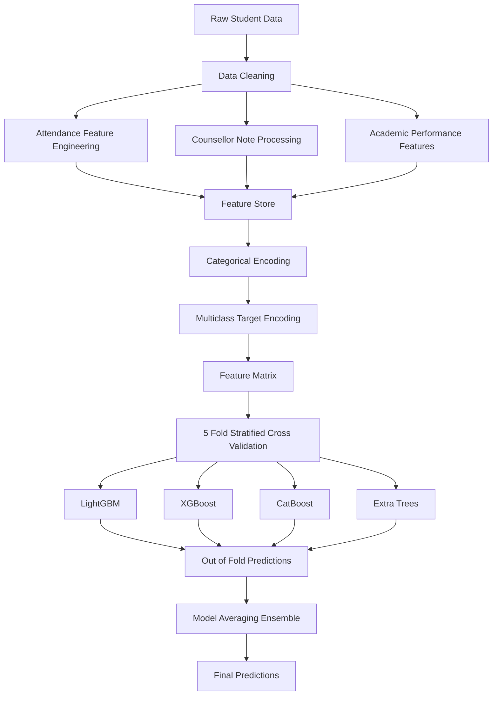
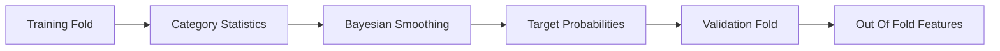
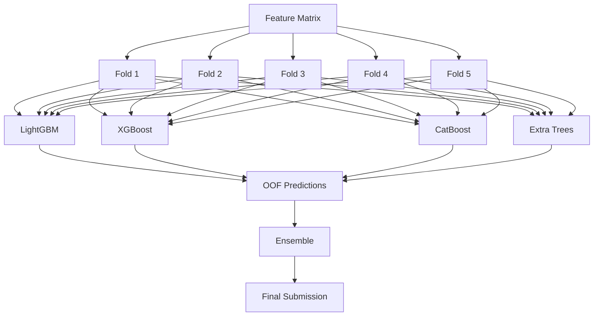

# Retina AI: Predict Student Dropout Risk with Machine Learning

A comprehensive machine learning solution developed for the Kaggle competition **"Retina AI: Predict Student Dropout Risk with Deep Learning"**.

**Competition Link:**
https://www.kaggle.com/competitions/retina-ai-predict-student-dropout-risk-with-deep-learning

**Competition Write-up:**
https://www.kaggle.com/competitions/retina-ai-predict-student-dropout-risk-with-deep-learning/writeups/retina-ai-kkw

---

## Abstract

Student attrition remains a significant challenge for educational institutions. Identifying students at risk of dropping out enables timely interventions, improved academic support, and better retention outcomes.

This project presents a feature-engineering-driven machine learning pipeline designed to predict student dropout risk using academic records, attendance histories, demographic information, and counsellor observations.

Rather than relying solely on deep learning, the solution focuses on extracting predictive signals from multiple data sources and combining several gradient boosting and tree-based models through cross-validated ensembling.

The final system integrates:

* Longitudinal attendance analysis
* Counsellor note intelligence
* Target encoding with leakage prevention
* Academic performance trend modelling
* Class imbalance handling
* Multi-model ensemble learning

---

# Problem Statement

Given historical student information, predict the dropout risk category for each student.

The challenge provides information from multiple sources:

* Student demographic attributes
* Academic performance records
* Semester-wise backlog information
* Attendance time series
* Counsellor intervention notes

The objective is to learn patterns that distinguish between students with varying levels of dropout risk.

---

# Solution Overview

The solution follows a feature-centric machine learning workflow.



---

# Dataset Components

The competition dataset consists of four primary sources:

| Dataset           | Description                        |
| ----------------- | ---------------------------------- |
| Train             | Labeled student records            |
| Test              | Unlabeled student records          |
| Attendance Series | Weekly attendance across semesters |
| Counsellor Notes  | Text-based intervention records    |

Each source contains information that contributes differently to dropout risk prediction.

---

# Feature Engineering

Feature engineering forms the core of the solution.

## 1. Academic Performance Features

Semester-wise CGPA values were transformed into trend-based indicators.

Generated features include:

* Mean CGPA
* CGPA standard deviation
* Minimum CGPA
* CGPA growth trend
* Semester-to-semester CGPA change

Examples:

```text
cgpa_mean
cgpa_std
cgpa_trend
cgpa_d21
cgpa_d32
cgpa_d43
```

These features capture both academic strength and progression over time.

---

## 2. Backlog Features

Backlog accumulation is a strong indicator of academic risk.

Created features include:

```text
total_backlogs
backlog_trend
bl_d21
bl_d32
```

These variables model both backlog volume and growth patterns.

---

## 3. Attendance Intelligence

Attendance data was transformed from weekly records into student-level behavioral indicators.

### Aggregate Statistics

For each student:

* Mean attendance
* Attendance variance
* Minimum attendance
* Maximum attendance

### Semester-Level Behaviour

Semester-wise attendance averages were generated through pivoting.

Examples:

```text
att_sem1_mean
att_sem2_mean
att_sem3_mean
```

### Subject-Level Attendance

Attendance was aggregated separately for each subject.

This allows the model to identify subject-specific engagement patterns.

### Attendance Trend Modelling

A global time index was created across all semesters.

Ordinary Least Squares regression was then used to estimate attendance trajectories.

```text
att_slope
```

Interpretation:

* Positive slope → improving engagement
* Negative slope → declining engagement

### Attendance Risk Signals

Additional features:

```text
att_low_weeks
att_recent_vs_early
att_sem3_2_diff
```

These features capture persistent absenteeism and late-stage disengagement.

---

# Counsellor Note Intelligence

Counsellor observations contain valuable qualitative information that is often unavailable in structured datasets.

Instead of applying large language models, domain-specific signals were extracted directly.

---

## Note Encoding

Each unique note was label encoded.

```text
note_id
```

---

## Situation Extraction

The first sentence of each counsellor note was extracted as the primary situation descriptor.

```text
situation_id
```

This helps isolate the root issue being discussed.

---

## Risk Keyword Detection

Rule-based keyword extraction was used to identify risk categories.

### High-Risk Indicators

Examples:

* Financial difficulties
* Severe personal issues
* Health emergencies
* Multiple backlogs

### Medium-Risk Indicators

Examples:

* Stress
* Attendance concerns
* Academic struggles

### Positive Indicators

Examples:

* No major issues
* Active participation
* Good progress

Generated features:

```text
note_high_risk_kw
note_med_risk_kw
note_low_risk_kw
```

---

# Target Encoding

A major performance improvement came from multiclass target encoding.

Two high-cardinality variables were encoded:

* note_id
* situation_id

The implementation used:

* Stratified K-Fold
* Out-of-Fold generation
* Bayesian smoothing
* Leakage prevention

---

## Encoding Workflow



Generated features:

```text
note_te_p0
note_te_p1
note_te_p2

sit_te_p0
sit_te_p1
sit_te_p2
```

A derived risk-spread feature was also created:

```text
note_risk_spread
```

---

# Cross-Feature Interactions

Several interaction terms were introduced to model relationships between academic performance and engagement.

Examples:

```text
cgpa_div_backlog
cgpa_x_backlog

att_d21
att_d32
```

These interactions often provide stronger signals than individual variables.

---

# Modeling Strategy

A single model was not sufficient to capture all patterns within the dataset.

The final solution combines four complementary algorithms.

---

## LightGBM

Used for:

* Fast training
* Strong handling of tabular data
* Effective feature interactions

---

## XGBoost

Used for:

* Robust generalization
* Strong nonlinear learning capability

---

## CatBoost

Used for:

* Superior categorical feature handling
* Reduced preprocessing requirements

---

## Extra Trees Classifier

Used for:

* High variance reduction
* Improved ensemble diversity

---

# Validation Strategy

The entire pipeline was evaluated using:

```text
5-Fold Stratified Cross Validation
```

This ensures:

* Stable performance estimation
* Balanced class representation
* Reduced overfitting

---
# Model Performance

The final ensemble model was evaluated using a held-out validation set.

## Evaluation Metrics

| Metric | Score |
|----------|---------|
| Accuracy | 75.70% |
| Macro F1 Score | 0.7098 |

## Confusion Matrix

The confusion matrix below illustrates class-wise prediction performance across the three dropout risk categories.

- Low-risk students were identified with high reliability (83.1% recall).
- High-risk students achieved strong detection performance (79.8% recall).
- Most classification errors occurred between the Medium and neighboring risk categories, reflecting the inherent overlap between student risk profiles.
- Very few Low-risk students were incorrectly classified as High-risk, indicating strong class separation.

<p align="center">
  
</p>

### Class-wise Analysis

| True Class | Correct Predictions | Recall |
|------------|--------------------|---------|
| Low | 1496 / 1800 | 83.1% |
| Medium | 416 / 750 | 55.5% |
| High | 359 / 450 | 79.8% |

The model demonstrates strong performance in identifying both Low-risk and High-risk students while maintaining reasonable discrimination of Medium-risk cases. This behavior is expected because Medium-risk students often share characteristics with both neighboring classes, making them inherently more challenging to classify.

## Training Architecture



---

# Ensemble Method

The final predictions are generated through probability averaging across all four models.

```text
Final Prediction

=
(LightGBM
 + XGBoost
 + CatBoost
 + ExtraTrees) / 4
```

This approach improves stability and reduces model-specific bias.

---

# Key Insights

Several observations emerged during experimentation:

1. Feature engineering contributed more than model complexity.
2. Attendance trajectories were highly predictive.
3. Counsellor notes contained strong latent risk indicators.
4. Target encoding substantially improved performance.
5. Ensemble learning consistently outperformed individual models.

---

# Reproducibility

Clone the repository:

```bash
git clone <repository-url>
cd retina-ai-dropout-prediction
```

Install dependencies:

```bash
pip install -r requirements.txt
```

Run training:

```bash
python train.py
```

Generate predictions:

```bash
python inference.py
```

---

# Technologies Used

* Python
* Pandas
* NumPy
* Scikit-Learn
* LightGBM
* XGBoost
* CatBoost
* PyTorch
* Matplotlib
* Seaborn

---

# References

Competition:
https://www.kaggle.com/competitions/retina-ai-predict-student-dropout-risk-with-deep-learning

Official Write-up:
https://www.kaggle.com/competitions/retina-ai-predict-student-dropout-risk-with-deep-learning/writeups/retina-ai-kkw

---

## Author

Anup Patil

B.Tech Computer Engineering
KK Wagh Institute of Engineering Education & Research

Nashik, India
